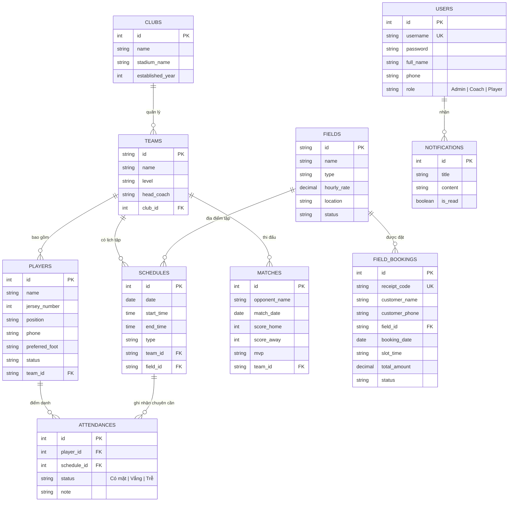

# SƠ ĐỒ MÔ HÌNH THỰC THỂ QUAN HỆ CƠ SỞ DỮ LIỆU (ERD)

Hệ thống quản lý Câu Lạc Bộ & Sân Bóng C1 bao gồm **10 bảng dữ liệu** quan hệ chặt chẽ, tối ưu chuẩn 3NF:

```mermaid
erDiagram
    CLUBS ||--o{ TEAMS : "quản lý"
    TEAMS ||--o{ PLAYERS : "bao gồm"
    TEAMS ||--o{ SCHEDULES : "có lịch tập"
    TEAMS ||--o{ MATCHES : "thi đấu"
    FIELDS ||--o{ SCHEDULES : "địa điểm tập"
    FIELDS ||--o{ FIELD_BOOKINGS : "được đặt"
    PLAYERS ||--o{ ATTENDANCES : "điểm danh"
    SCHEDULES ||--o{ ATTENDANCES : "ghi nhận chuyên cần"
    USERS ||--o{ NOTIFICATIONS : "nhận"

    USERS {
        int id PK
        string username UK
        string password
        string full_name
        string phone
        string role "Admin | Coach | Player"
    }

    CLUBS {
        int id PK
        string name
        string stadium_name
        int established_year
    }

    TEAMS {
        string id PK
        string name
        string level
        string head_coach
        int club_id FK
    }

    PLAYERS {
        int id PK
        string name
        int jersey_number
        string position
        string phone
        string preferred_foot
        string status
        string team_id FK
    }

    FIELDS {
        string id PK
        string name
        string type
        decimal hourly_rate
        string location
        string status
    }

    SCHEDULES {
        int id PK
        date date
        time start_time
        time end_time
        string type
        string team_id FK
        string field_id FK
    }

    ATTENDANCES {
        int id PK
        int player_id FK
        int schedule_id FK
        string status "Có mặt | Vắng | Trễ"
        string note
    }

    FIELD_BOOKINGS {
        int id PK
        string receipt_code UK
        string customer_name
        string customer_phone
        string field_id FK
        date booking_date
        string slot_time
        decimal total_amount
        string status
    }

    MATCHES {
        int id PK
        string opponent_name
        date match_date
        int score_home
        int score_away
        string mvp
        string team_id FK
    }

    NOTIFICATIONS {
        int id PK
        string title
        string content
        boolean is_read
    }
```

